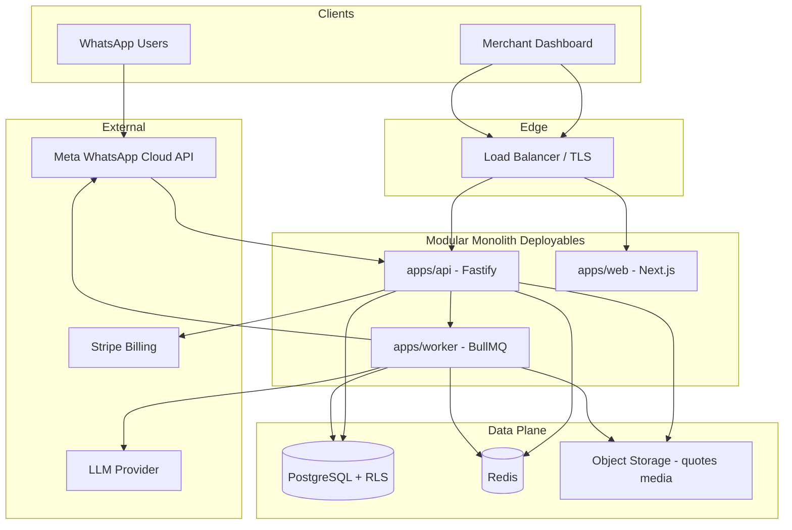
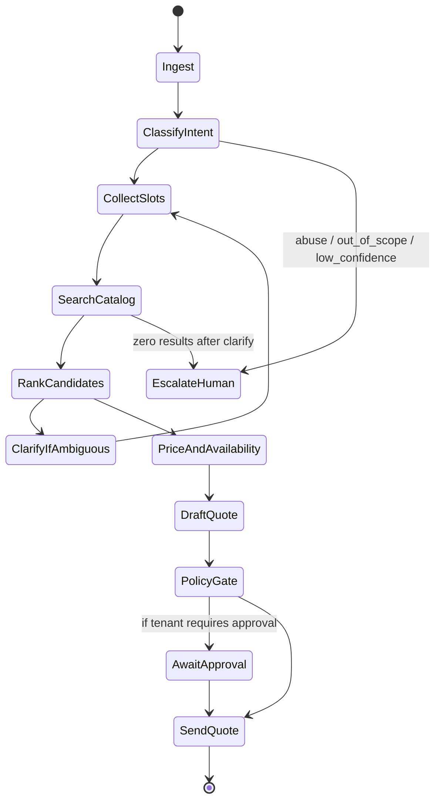
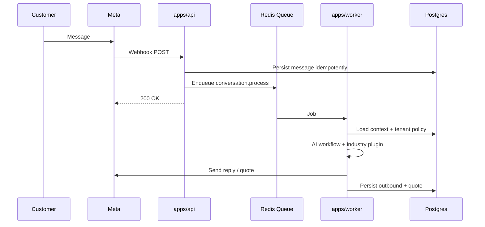

# AutoQuoteAI — System Architecture

> The Shopify of AI WhatsApp sales agents.  
> First industry plugin: **Automotive parts**. Platform core is industry-agnostic.

**Status:** Locked CTO defaults (market/outcome not confirmed by founder — defaults below).  
**Rule:** Quote-first SaaS. Not a chatbot. Modular monolith → extract services only when metrics demand it.

---

## 0. Locked product decisions

| Decision | Choice | Rationale |
|----------|--------|-----------|
| Launch posture | Global-portable (Stripe + Meta Cloud API) | Copy to any machine; add regional PSPs later via adapters |
| Primary outcome | **Qualified quote** → PDF/link; human approve optional | Fastest path to paid value; orders/payments phase 2 |
| WhatsApp ownership | **Tenant brings their own WABA** | Shopify model — we are the agent OS, not the number landlord |
| Shape | **Modular monolith** (apps + packages) | Day-1 production quality without microservice tax |
| Tenancy | Shared Postgres + `tenant_id` + RLS | Survives 100k tenants; DB-per-tenant does not |
| AI | Deterministic **sales workflow + tools** | Identify → match → price → quote → escalate |
| Industries | Plugin SDK; automotive is first plugin | Hardware, plumbing, electrical, tyre, furniture, appliance later |

**CTO challenge rejected alternatives:** microservices day-1, custom billing engine, platform-owned WhatsApp numbers, free-form chatbots, schema-per-tenant.

---

## 1. System architecture



**Deployables (3 processes, one codebase):**

1. `apps/web` — merchant SaaS UI  
2. `apps/api` — REST + webhooks + auth  
3. `apps/worker` — AI workflows, WhatsApp send, quote PDF, billing sync  

**Packages (domain modules):** `db`, `shared`, `core`, `industry-sdk`, `industry-automotive`, `whatsapp`, `ai`, `billing`.

---

## 2. Database design

### Principles
- Every business row has `tenant_id` (UUID).
- Postgres Row Level Security (RLS) enforced; app sets `app.tenant_id` per request.
- Soft-delete where audit matters; hard-delete only for GDPR/POPIA erasure jobs.
- Industry-specific fields live in JSONB `attributes` + plugin-owned tables prefixed by industry.

### Core entities
- `tenants` — business account, slug, industry_key, status, timezone, currency
- `users` / `memberships` — people + role in tenant
- `roles` / `permissions` — RBAC
- `subscriptions` / `subscription_items` — Stripe mirror
- `whatsapp_accounts` — WABA id, phone_number_id, token ref (encrypted), quality rating cache
- `contacts` — end customers (WhatsApp wa_id)
- `conversations` — thread per contact+channel
- `messages` — inbound/outbound, status, raw payload ref
- `catalog_products` — generic SKU catalog
- `catalog_variants` — price, stock, SKU
- `quotes` / `quote_lines` — commercial artifact
- `ai_runs` — workflow execution audit
- `audit_logs` — security/compliance

### Automotive plugin tables
- `auto_fitments` — year/make/model/engine → product
- `auto_oem_numbers` — OEM/interchange identifiers
- `auto_vehicles` — normalized vehicle identity

### Scale path to 100k+ tenants
1. Vertical scale Postgres + connection pooler (PgBouncer).  
2. Read replicas for dashboard queries.  
3. Partition hot tables (`messages`, `ai_runs`) by time.  
4. Tenant shard key ready: `tenant_id` in every query; later Citus or app-level shard map.  
5. Redis for session, rate limits, queues — never as source of truth.

---

## 3. API design

Base: `/v1`  
Auth: session cookie (dashboard) + API keys (integrations) + Meta webhook verify.

| Method | Path | Purpose |
|--------|------|---------|
| GET | `/health` | Liveness |
| GET | `/ready` | DB/Redis readiness |
| POST | `/v1/auth/*` | Sign up / sign in / logout |
| GET/POST | `/v1/tenants` | Create/list tenants (membership scoped) |
| GET/PATCH | `/v1/tenants/:id` | Tenant settings |
| GET/POST | `/v1/catalog/products` | Catalog CRUD |
| POST | `/v1/catalog/import` | CSV/JSON import job |
| GET/POST | `/v1/quotes` | Quotes |
| POST | `/v1/quotes/:id/send` | Send quote via WhatsApp |
| GET | `/v1/conversations` | Inbox |
| POST | `/v1/conversations/:id/takeover` | Human takeover |
| POST | `/v1/whatsapp/webhook` | Meta webhook |
| GET | `/v1/whatsapp/webhook` | Meta verify |
| POST | `/v1/billing/checkout` | Stripe Checkout |
| POST | `/v1/billing/portal` | Customer portal |
| POST | `/v1/billing/webhook` | Stripe webhooks |
| GET | `/v1/admin/ai-runs` | Debug AI workflows |

Errors: RFC7807 problem+json. Idempotency-Key on quote send & billing.

---

## 4. AI workflow (not a chatbot)

State machine per conversation turn:



**Tools (function calls):** `search_products`, `get_fitment` (automotive), `get_price_stock`, `create_quote`, `send_whatsapp_template`, `escalate_to_human`.

**Guarantees:**  
- LLM never invents prices — prices only from catalog tools.  
- Every AI action logged in `ai_runs`.  
- Confidence thresholds + mandatory clarify loops.  
- Human takeover freezes AI until released.

---

## 5. WhatsApp workflow



- 24h customer care window vs template messages outside window.  
- Per-tenant rate limits & quality rating monitoring.  
- Media downloaded to object storage; never trust Meta URLs long-term.  
- Webhook signature validation required in production.

---

## 6. Multi-tenant SaaS

- **Tenant** = paying business.  
- **Membership** = user↔tenant with role.  
- Subdomain optional later (`acme.autoquote.ai`); v1 uses tenant switcher.  
- Data isolation: RLS + app middleware.  
- Feature flags per plan + per tenant.  
- Industry plugin bound per tenant (`industry_key`).  
- No cross-tenant queries except super-admin audit roles.

---

## 7. Authentication & permissions

**Roles (tenant-scoped):**
- `owner` — billing, delete tenant, all settings  
- `admin` — users, WhatsApp connect, catalog, policies  
- `sales` — inbox, quotes, takeover  
- `viewer` — read-only  

**Permissions examples:** `catalog:write`, `quotes:approve`, `whatsapp:connect`, `billing:manage`, `inbox:takeover`, `ai:configure`.

**Auth model:** email/password + magic link (Better Auth). Invite flow for members.  
**API keys:** scoped, hashed at rest, for ERP importers.

---

## 8. Deployment architecture

**Local:** Docker Compose → Postgres, Redis, MinIO, api, worker, web.  

**Production (phase 1):**  
- Containers on single region (Fly.io / Railway / AWS ECS/Fargate).  
- Managed Postgres + Redis.  
- S3-compatible object storage.  
- Secrets via platform secret store (never in git).  

**Production (phase 2):**  
- Separate autoscaling groups for api vs worker.  
- CDN for dashboard.  
- Multi-AZ Postgres.  

**Observability:** OpenTelemetry traces, structured JSON logs, metrics (queue depth, WhatsApp send fail, AI cost/tenant).

---

## 9. Scalability (100k+ businesses)

| Layer | Strategy |
|-------|----------|
| API | Stateless horizontal scale behind LB |
| Workers | Partitioned queues by `tenant_id` hash; concurrency caps per tenant |
| DB | Pooling, indexes on `(tenant_id, ...)`, partitioning, replicas |
| WhatsApp | Per-tenant tokens; never single global bottleneck lock |
| AI | Budget caps per plan; cache embeddings per catalog version |
| Noisy neighbor | Rate limits + fair queue scheduling |
| Cold tenants | Tier storage for inactive message history |

Target early SLOs: API p95 < 300ms (non-AI); webhook ack < 200ms; quote draft < 8s p95.

---

## 10. Subscription billing

**Plans (initial):**
- **Starter** — 1 WhatsApp number, N conversations/mo, 1 seat  
- **Growth** — higher limits, approval workflows, CSV import  
- **Scale** — multi-number, API access, SSO later  

**Metering:** conversations processed, AI tokens (soft), quotes sent. Soft caps → warn; hard caps → queue pause with dashboard CTA.

**Stripe:** Customer + Subscription per tenant. Webhooks update `subscriptions.status`. Entitlements service gates features.

**Adapter interface:** `BillingProvider` so Paystack/PayFast can be added without rewriting core.

---

## Industry plugin contract

```ts
interface IndustryModule {
  key: string; // "automotive"
  displayName: string;
  slotSchema: ZodSchema; // what to collect from customer
  enrichSearch(query, slots, ctx): Promise<SearchHint[]>;
  explainMatch(product, slots): string;
  quotePresentation(lines, ctx): QuotePresentation;
}
```

Automotive implements fitment + OEM/interchange. Other industries implement their own slot schemas without touching core.

---

## Phase roadmap

1. **Foundation (this scaffold)** — monorepo, schema, auth, tenants, health, plugin SDK, automotive stub, WA webhook stub, Stripe stub, dashboard shell.  
2. **Quote loop** — catalog import, AI tools, quote PDF, WA send.  
3. **Inbox + takeover** — merchant UX.  
4. **Billing live** — Stripe Checkout + entitlements.  
5. **Hardening** — RLS tests, load tests, observability.  
6. **Next industries** — tyre, plumbing, … as plugins.
